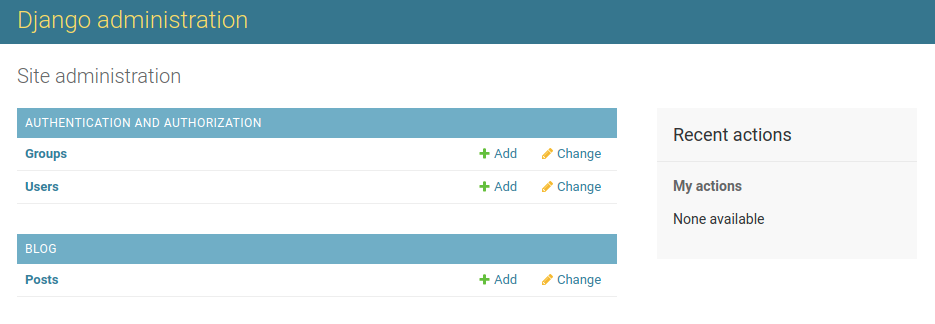

# DJango Study
mestanam

# Requirements
ubuntu  18.0.4 \
Django  3.0.4\
python  3.6\
pip     20.1.1

# set up steps for the environment
##createing an isolated Python environment
1.Install virtualenv
```bash
pip install virtualenv
```
2.create virtualenv 
```bash
virtualenv my_env ### my_env <- virtualenvironment name 
```
3.activate your virtualenvironment
```bash
source my_env/bin/activate
```
you can deactivate any time with the deactivte commnad\
4.install Django with pip 
```bash
pip install Django==3.0.4
```
Django will be installed in the Python site-packages/ directory of your virtual environment.\
Check whether Django has been successfully installed.\
Run python on a terminal.
```bash
python
```
Run the following command from python console. import Django, and check its version, as follows:
```python
import django
django.get_version()
'3.0.4'
```
##Create project
1.Run the following command from your shell.
```bash
django-admin startproject mysite ####(mysite proejct name)
```
this will create Django project with the name "mysite"
2.To Complete the project setup.
```bash
cd mysite
python manage.py migrate
``` 
##Running the Development server
1.Start the development server by typing the following command from your project's root folder.
```bash
python manage.py runserver
```
2.Check your development sever works properly. Open http://127.0.0.1:8000/ in your browser. 
##Create an application
```bash
python manage.py startapp blog #### blog <- application name
```
##Designing the application data schema
Define models in the blog/models.py
##Activating application
Edit the mysite/settings.py file and add blog.app.BlogConfig to the INSTALLED_APPS setting.
##Creating and applying migrations
1.Create an initial migration.
```bash
python manage.py makemigrations blog
```
Django creat 0001_initial.py file inside the migrations directory of the application.\

2.Look at the SQL code that Django will execute in the database to create the table for models. 
```bash
python manage.py sqlmigrate blog 0001
```
sqlmigrate command takes migration names and returns their SQL without executing it.
3.Sync database with the new model.
```bash
python manage.py migrate
```
This command apply existing migrations\
**NOTE**
```text
If you edit your models.py file in order to add, remove, or change fields of existing models, 
or if you add new models, you will have to create ne migration using the makemigrations command.
The migration will allow Django to keep track of model changes. Then, you will have to apply it
with the migrate command to keep the database in sync with your model 
```
##Creating an administration site for your models
1.Creating a superuser
```bash
python manage.py createsuperuser
```
2.The Django administration site
```bash
python manage.py runserver
```
Log in using the credentials of the user you created in the preceding step.\
You will see the admin site index page, as shown in the following screenshot:

the Group and User models you see in the preceding screenhost are part of the Django authentication \
framework located in django.contrib.auth.\
\
3.Adding models to the administration site
Edit the blog/admin.py file, add your models
```text
from django.contrib import admin
from .models import Post

admin.site.register(Post)
```
Reload the admin site in your browser. You should see the model on the admin site, as follows:


###Customizing the way models are displayed
1.Edit the admin.py file of application and change it, as follows:
```text
from django.contrib import admin
from .models import Post

@admin.register(Post)
class PostAdmin(admin.ModelAdmin):
    list_display = ('title', 'slug', 'author', 'publish', 'status')
```
We are telling the Django admin site that our model is registered in the admin site using a\
custom class that inherits from ModelAmin. In this case, we can include information about\
how to display the model in the admin site and how to interact with it.\
The list_display attribute allows you to set the fields of your model that you want to display\
in the admin object list page. The @admin.register() decorator peforms the same function \
as the admin.site.register() function we have replaced.\
**note**
```text
the Decorator is a design pattern that allows behavior to be added to an individuual object, 
dynamically, without affecting the behavior of the objects from the same class. 
```
2.Customize the admin model with some more options, using the following code:
```text
from django.contrib import admin
from .models import Post

@admin.register(Post)
class PostAdmin(admin.ModelAdmin):
    list_display = ('title', 'slug', 'author', 'publish', 'status')
    list_filter = ('status', 'created', 'publish', 'author')
    search_field = ('title', 'body')
    prepopulated_fields = {'slug' : ('title',) }
    raw_id_fields = ('author',)
    date_hierarchy = 'publish'
    ordering = ('status', 'publish')
```
##Working with QuerySet and managers
Django comes with powerful database abstraction API **ORM(Object-relational mapper)**. ORM is  \
compatible with MySQL, PostgreSQL, SQLite, and Oracle.
##Building list and detail views
Start by creating a view to display the list of posts.
1.Edit the blog/view.py file. Chang it, as follows:
```text
from django.shortcuts import render, get_object_or_404
from .models import Post

def post_list(request):
    posts = Post.published.all()
    return render(request, 'blog/post/list.html', {'posts':posts})

def post_detail(request, year, month, day, post):
    post = get_object_or_404(Post, slug=post, status='published', 
                             publish__year=year, 
                             publish__month=month, 
                             publish__day=day)
    return render(request, 'blog/post/detail.html', {'post':post})
```
2.Adding URL patterns for your view

Django runs through each URL pattern and stop at the first one matches the requested URL.

Create an urls.py file in the directory of the application and add the following lines:
```text
from django.urls import path
from . import views

app_name = 'blog'

urlpatterns = [
    # post views
    path('', views.post_list, name='post_list'),
    path('<int:year>/<int:month>/<int:day>/<slug:post>/',
         views.post_detail, name='post_detail')
]
```
Include the URL patterns of the application in the main URL patterns of the project.\
Edit the urls.py file located in the mysite directory of your project, make it, as follows:
```text
from django.urls import path
from . import views

app_name = 'blog'

urlpatterns = [
    # post views
    path('', views.post_list, name='post_list'),
    path('<int:year>/<int:month>/<int:day>/<slug:post>/',
         views.post_detail, name='post_detail')
]
```
Add follows in the blog/model.py file:
```text
from django.urls import reverse

class Post(models.Model):
    # ....
    def get_absolute_url(self):
        return reverse('blog:post_detail',args=[self.publish.year,
                                                self.publish.month,
                                                self.publish.day,
                                                self.slug])
    ##reverse() method that allows you to build URLs by their name and passing optional parameters.
```
Use get_absolute_url() method in our templates to link to specific posts.

Creating templates for your views.
Create the following directories and files inside your application directory:
```text
    template/
        blog/
            base.html 
        post/
            list.html
            detail.html
```
base.html file will include the main HTML structure of the website and divide the content in the main content area \
and a sidebar. The list.html and detail.html files will inherit from the base.html file to render the blog post list\
and detail views, respectively.

Django has a powerful template language that allows you to specify how data is displayed. It is based on template\
tags, template variables, and template filters:
- Template tags control the rendering of the template and look like .
- Template variables get replace with values when the template is rendered and look like {{ variable }}.
- Template filters allow you to modify variables for display and look like {{ variable|filter }}.
