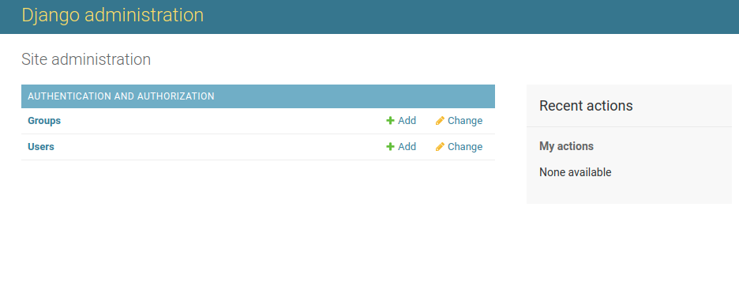

# DJango Study
mestanam

# Requirements
ubuntu  18.0.4 \
Django  3.0.4\
python  3.6\
pip     20.1.1

# set up steps for the environment
##createing an isolated Python environment
1.Install virtualenv
```bash
pip install virtualenv
```
2.create virtualenv 
```bash
virtualenv my_env ### my_env <- virtualenvironment name 
```
3.activate your virtualenvironment
```bash
source my_env/bin/activate
```
you can deactivate any time with the deactivte commnad\
4.install Django with pip 
```bash
pip install Django==3.0.4
```
Django will be installed in the Python site-packages/ directory of your virtual environment.\
Check whether Django has been successfully installed.\
Run python on a terminal.
```bash
python
```
Run the following command from python console. import Django, and check its version, as follows:
```python
import django
django.get_version()
'3.0.4'
```
##Create project
1.Run the following command from your shell.
```bash
django-admin startproject mysite ####(mysite proejct name)
```
this will create Django project with the name "mysite"
2.To Complete the project setup.
```bash
cd mysite
python manage.py migrate
``` 
##Running the Development server
1.Start the development server by typing the following command from your project's root folder.
```bash
python manage.py runserver
```
2.Check your development sever works properly. Open http://127.0.0.1:8000/ in your browser. 
##Create an application
```bash
python manage.py startapp blog #### blog <- application name
```
##Designing the application data schema
Define models in the blog/models.py
##Activating application
Edit the mysite/settings.py file and add blog.app.BlogConfig to the INSTALLED_APPS setting.
##Creating and applying migrations
1.Create an initial migration.
```bash
python manage.py makemigrations blog
```
Django creat 0001_initial.py file inside the migrations directory of the application.\

2.Look at the SQL code that Django will execute in the database to create the table for models. 
```bash
python manage.py sqlmigrate blog 0001
```
sqlmigrate command takes migration names and returns their SQL without executing it.
3.Sync database with the new model.
```bash
python manage.py migrate
```
This command apply existing migrations\
**NOTE**
```text
If you edit your models.py file in order to add, remove, or change fields of existing models, 
or if you add new models, you will have to create ne migration using the makemigrations command.
The migration will allow Django to keep track of model changes. Then, you will have to apply it
with the migrate command to keep the database in sync with your model 
```
##Creating an administration site for your models
1.Creating a superuser
```bash
python manage.py createsuperuser
```
2.The Django administration site
```bash
python manage.py runserver
```
Log in using the credentials of the user you created in the preceding step.\
You will see the admin site index page, as shown in the following screenshot:

the Group and User models you see in the preceding screenhost are part of the Django authentication \
framework located in django.contrib.auth.\
\
3.Adding models to the administration site
Edit the blog/admin.py file, add your models
```python
from django.contrib import admin
from .models import Post

admin.site.register(Post)
```
Reload the admin site in your browser. You should see the model on the admin site, as follows:


